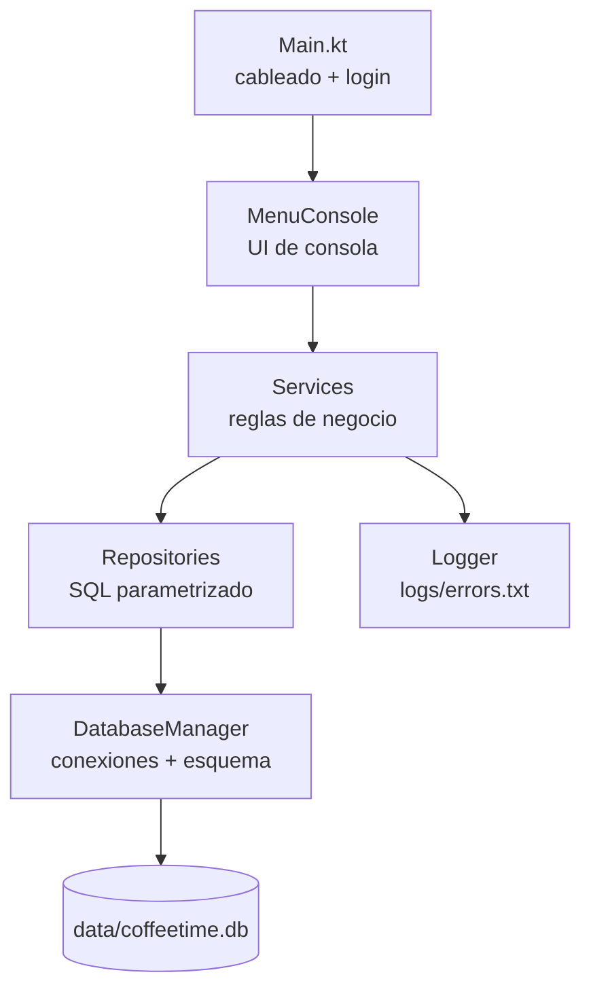
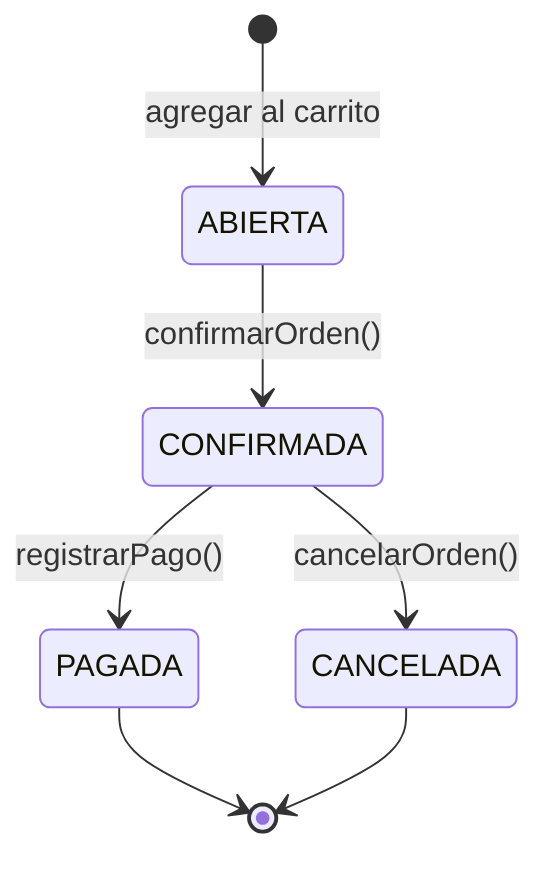
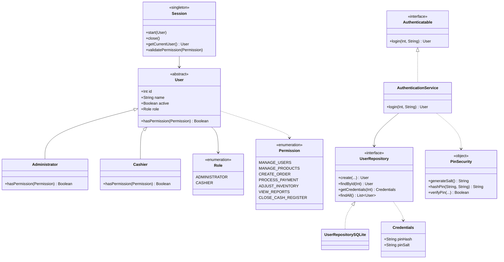
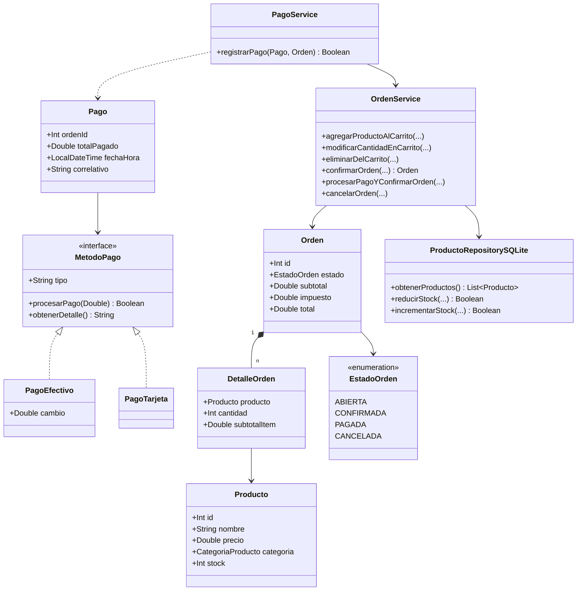
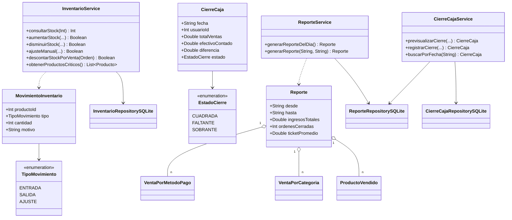

# Coffee Time

Integrantes:
Erick Eduardo Fuentes García FG220265
Luis Gustavo Hernández Rivas HR233189
Jairo José Hernández Abrego HA190640
William Alejandro Ortíz Artiga OA222716
César Elías González Rodas GR220764

Aplicación de gestión de cafetería en consola (proyecto universitario). Cubre el ciclo completo de operación de un local: autenticación con PIN y roles, catálogo de productos, carrito de órdenes, cobro en efectivo o tarjeta, control de inventario con alertas de stock crítico, reportes de ventas y cierre de caja diario.

Todo corre sobre una interfaz de texto y persiste en una base SQLite local (`data/coffeetime.db`). El objetivo académico es aplicar POO (herencia, abstracción, polimorfismo, interfaces/estrategias), validaciones, manejo de excepciones y control de acceso basado en roles.

## Funcionalidades

| Módulo | Qué hace |
| --- | --- |
| Autenticación | Login por ID + PIN. PIN guardado como hash PBKDF2, nunca en texto plano |
| Roles | `ADMINISTRATOR` (todos los permisos) y `CASHIER` (crear orden, procesar pago) |
| Órdenes | Carrito en memoria: agregar, modificar cantidad, eliminar, ver desglose, confirmar |
| Pagos | Efectivo (con cálculo de cambio) o tarjeta. Genera correlativo por pago |
| Inventario | Listado por categoría, stock crítico (<= 5), entradas, salidas, ajuste manual, alta y baja de productos |
| Reportes | Reporte de la jornada o por rango de fechas: ingresos, ticket promedio, productos más vendidos, ventas por categoría y por método de pago |
| Cierre de caja | Previsualización, conteo de efectivo y estado `CUADRADA` / `FALTANTE` / `SOBRANTE` |

## Tech stack

| Componente | Versión / detalle |
| --- | --- |
| Lenguaje | Kotlin 2.3.21 (JVM) |
| Toolchain | JDK 17 (`jvmToolchain(17)`, resuelto por foojay-resolver) |
| Build | Gradle 9.3.0 con Kotlin DSL (`build.gradle.kts`) |
| Persistencia | SQLite vía `org.xerial:sqlite-jdbc:3.53.4.0` — JDBC plano, sin ORM |
| Tests | `kotlin("test")` sobre JUnit Platform |
| Interfaz | Consola (stdin/stdout, salida en español) |

Sin frameworks de DI: las dependencias se cablean a mano en `main()`.

## Inicializar el proyecto

### Requisitos

- JDK 17 o superior disponible como `JAVA_HOME`.
- No hace falta instalar Gradle: el repo incluye el wrapper (`gradlew` / `gradlew.bat`).

Si `java` no está en el `PATH`, apuntá `JAVA_HOME` a un JDK antes de usar el wrapper. Por ejemplo, con el runtime que trae IntelliJ:

```powershell
# PowerShell (Windows)
$env:JAVA_HOME = "C:/Program Files/JetBrains/IntelliJ IDEA 2026.2.3/jbr"
```

```bash
# Bash / macOS / Linux
export JAVA_HOME=/ruta/a/jdk-17
```

### Clonar y ejecutar

```bash
git clone https://github.com/CesarGonzalez2601/coffee-time.git
cd coffee-time

./gradlew run -q --console=plain     # inicia la app (Windows: .\gradlew.bat run -q --console=plain)
```

> **Ejecutá siempre desde la raíz del repo.** `DatabaseManager` escribe `data/coffeetime.db` y `Logger` escribe `logs/errors.txt` con rutas relativas; desde otro directorio la app crea una segunda base.

La primera ejecución crea el esquema (`CREATE TABLE IF NOT EXISTS`, idempotente), inserta 6 productos de ejemplo y siembra dos usuarios:

| ID | PIN | Rol |
| --- | --- | --- |
| 1 | `1234` | ADMINISTRATOR |
| 2 | `4321` | CASHIER |

Cambiá esos PIN antes de usar el proyecto en cualquier entorno real: están en el código fuente (`Main.kt`) y son públicos.

### Otros comandos

```bash
./gradlew build           # compila + corre tests
./gradlew compileKotlin   # solo compila (feedback más rápido)
./gradlew test            # tests (JUnit Platform)
./gradlew clean           # limpia build/
```

Para empezar de cero, borrá `data/coffeetime.db` y volvé a ejecutar.

## Arquitectura

Capas: la UI nunca toca SQL y los repositorios nunca contienen reglas de negocio.



### Estructura del proyecto

```
coffee-time/
├── build.gradle.kts              # plugins, dependencias, tarea run (stdin + UTF-8)
├── settings.gradle.kts           # rootProject.name = "CoffeeTime", foojay-resolver
├── gradle.properties             # kotlin.code.style=official
├── gradlew / gradlew.bat         # wrapper: no hace falta instalar Gradle
├── gradle/wrapper/               # gradle-wrapper.jar + .properties (Gradle 9.3.0)
├── CLAUDE.md                     # guía para agentes de IA que tocan el repo
├── README.md
│
├── data/
│   └── coffeetime.db             # base SQLite, se crea sola en el primer arranque
├── logs/
│   └── errors.txt                # log de Logger: [timestamp] [LEVEL] mensaje
│
├── build/                        # salida de compilación (ignorada por git)
│
└── src/
    ├── main/kotlin/com/coffeetime/
    │   ├── Main.kt               # entrypoint: init DB, cablea dependencias, login
    │   │
    │   ├── model/                # entidades y enums, sin lógica de persistencia
    │   │   ├── User.kt           # abstracta; Administrator.kt / Cashier.kt la extienden
    │   │   ├── Administrator.kt
    │   │   ├── Cashier.kt
    │   │   ├── Role.kt           # enum ADMINISTRATOR | CASHIER
    │   │   ├── Permission.kt     # enum de 7 permisos
    │   │   ├── Credentials.kt    # pinHash + pinSalt
    │   │   ├── Producto.kt
    │   │   ├── CategoriaProducto.kt
    │   │   ├── Orden.kt          # subtotal / impuesto / total son getters derivados
    │   │   ├── DetalleOrden.kt
    │   │   ├── EstadoOrden.kt
    │   │   ├── Pago.kt
    │   │   ├── MetodoPago.kt     # interfaz de estrategia de pago
    │   │   ├── PagoEfectivo.kt
    │   │   ├── PagoTarjeta.kt
    │   │   ├── MovimientoInventario.kt  # + enum TipoMovimiento
    │   │   ├── CierreCaja.kt     # + enum EstadoCierre
    │   │   └── Reporte.kt        # + ProductoVendido, VentaPorCategoria, VentaPorMetodoPago
    │   │
    │   ├── repository/           # acceso a datos, SQL parametrizado
    │   │   ├── UserRepository.kt          # única interfaz de repositorio
    │   │   ├── UserRepositorySQLite.kt
    │   │   ├── ProductoRepositorySQLite.kt
    │   │   ├── InventarioRepositorySQLite.kt
    │   │   ├── ReporteRepositorySQLite.kt
    │   │   └── CierreCajaRepositorySQLite.kt
    │   │
    │   ├── service/              # reglas de negocio y transacciones
    │   │   ├── Authenticatable.kt
    │   │   ├── AuthenticationService.kt
    │   │   ├── Session.kt        # singleton del usuario logueado + validatePermission
    │   │   ├── OrdenService.kt   # carrito en memoria + transacciones de orden
    │   │   ├── PagoService.kt
    │   │   ├── InventarioService.kt
    │   │   ├── ReporteService.kt
    │   │   └── CierreCajaService.kt
    │   │
    │   ├── database/
    │   │   └── DatabaseManager.kt  # conexiones, PRAGMA foreign_keys, todo el DDL
    │   │
    │   ├── util/
    │   │   ├── MenuConsole.kt    # menús, lectura validada de entrada
    │   │   ├── Logger.kt
    │   │   └── PinSecurity.kt    # PBKDF2WithHmacSHA256, 120k iteraciones
    │   │
    │   └── exception/            # excepciones propias del dominio
    │       ├── IncorrectPinException.kt
    │       ├── InvalidInputException.kt
    │       ├── PermissionDeniedException.kt
    │       └── UserNotFoundException.kt
    │
    └── test/                     # aún no existe; el build ya está configurado para JUnit
```

Resumen por paquete:

| Paquete | Rol en la arquitectura |
| --- | --- |
| `model` | Entidades, enums y estrategias. Sin SQL ni I/O |
| `repository` | Un método = una operación SQL con `PreparedStatement` |
| `service` | Reglas de negocio, transacciones manuales, orquestación entre repos |
| `database` | Conexiones (`getConnection`) y esquema (`initialize`) |
| `util` | UI de consola, logging y hashing de PIN |
| `exception` | Errores de dominio, todos extienden `Exception` |

Carpetas generadas en tiempo de ejecución o por el IDE (`build/`, `.gradle/`, `.kotlin/`, `.idea/` parcial) están en `.gitignore`. `data/coffeetime.db` y `logs/errors.txt` **sí** están versionados: el log cambia en cada ejecución, revisá `git status` antes de commitear.

### Ciclo de vida de una orden



`ABIERTA` es solo el carrito en memoria (id `0`), nunca se persiste. El stock se descuenta al agregar al carrito, no al pagar: `reducirStock` usa `WHERE id = ? AND stock >= ?` como chequeo de disponibilidad, y modificar, eliminar o cancelar devuelve la diferencia.

## Diagrama de clases

### Autenticación y usuarios



### Órdenes y pagos



`Orden.subtotal`, `impuesto` (IVA 10%) y `total` son getters derivados de `DetalleOrden.subtotalItem`; solo `ordenes.total` se persiste.

### Inventario, reportes y cierre de caja



`InventarioService.descontarStockPorVenta` solo escribe filas de auditoría en `movimientos_inventario` y dispara alertas de stock crítico: no vuelve a tocar `productos.stock`, porque el descuento ya ocurrió al armar el carrito.

## Modelo de datos (ER)

```mermaid
erDiagram
    users ||--o{ cierres_caja : registra
    productos ||--o{ detalle_ordenes : aparece_en
    productos ||--o{ movimientos_inventario : tiene
    ordenes ||--o{ detalle_ordenes : contiene
    ordenes ||--o{ pagos : cobrada_con

    users {
        INTEGER id PK
        TEXT name
        TEXT pin_hash
        TEXT pin_salt
        TEXT role
        INTEGER active
        TEXT created_at
    }
    productos {
        INTEGER id PK
        TEXT nombre
        REAL precio
        TEXT categoria
        INTEGER stock
    }
    ordenes {
        INTEGER id PK
        TEXT fecha
        TEXT estado
        REAL total
    }
    detalle_ordenes {
        INTEGER id PK
        INTEGER orden_id FK
        INTEGER producto_id FK
        INTEGER cantidad
        REAL subtotal
    }
    pagos {
        INTEGER id PK
        INTEGER orden_id FK
        REAL total_pagado
        TEXT metodo_pago
        TEXT correlativo
        TEXT fecha_hora
    }
    movimientos_inventario {
        INTEGER id PK
        INTEGER producto_id FK
        TEXT tipo
        INTEGER cantidad
        TEXT motivo
        TEXT fecha
    }
    cierres_caja {
        INTEGER id PK
        TEXT fecha UK
        INTEGER usuario_id FK
        INTEGER cantidad_ordenes
        REAL total_ventas
        REAL total_efectivo
        REAL total_tarjeta
        REAL efectivo_contado
        TEXT fecha_hora
    }
```



Todo el DDL vive en `DatabaseManager.initialize()`; no hay archivos de migración. Agregar una tabla significa agregar un `private fun createXTable(connection)` y llamarlo desde `initialize()`.

Las claves foráneas se activan por conexión con `PRAGMA foreign_keys = ON` dentro de `getConnection()`: cualquier código que abra una conexión por fuera de ese método pierde la validación de FK.

## Convenciones

- **El código es bilingüe**: la infraestructura de autenticación está en inglés (`User`, `Role`, `Permission`, `Session`) y el dominio de la cafetería en español (`Producto`, `Orden`, `Pago`, `InventarioService`), incluidas las tablas y toda la salida de consola. Respetá el idioma del módulo que estés tocando.
- SQL siempre parametrizado con `?`, nunca interpolado en strings.
- Entrada de consola vía `MenuConsole.leerEntero` / `leerDouble` / `leerTexto` / `leerConfirmacion`, que repiten hasta recibir un valor válido. No uses `readln()` directo en el menú.
- Los servicios devuelven `Boolean` y loguean con `Logger` para fallos esperados (stock, validaciones); lanzar excepción se reserva para autenticación y permisos.
- Estilo `kotlin.code.style=official`, argumentos nombrados uno por línea en llamadas de varios parámetros.

## Flujo de trabajo Git

Proyecto en equipo. El trabajo se hace en ramas `feature/<nombre>` que se integran a `main` mediante Pull Request; también existen las ramas `dev` y `uat`.

Ejecutar la app ensucia el árbol de trabajo: `logs/errors.txt` está versionado y cada login le agrega líneas. No mezcles ese ruido con cambios no relacionados.
