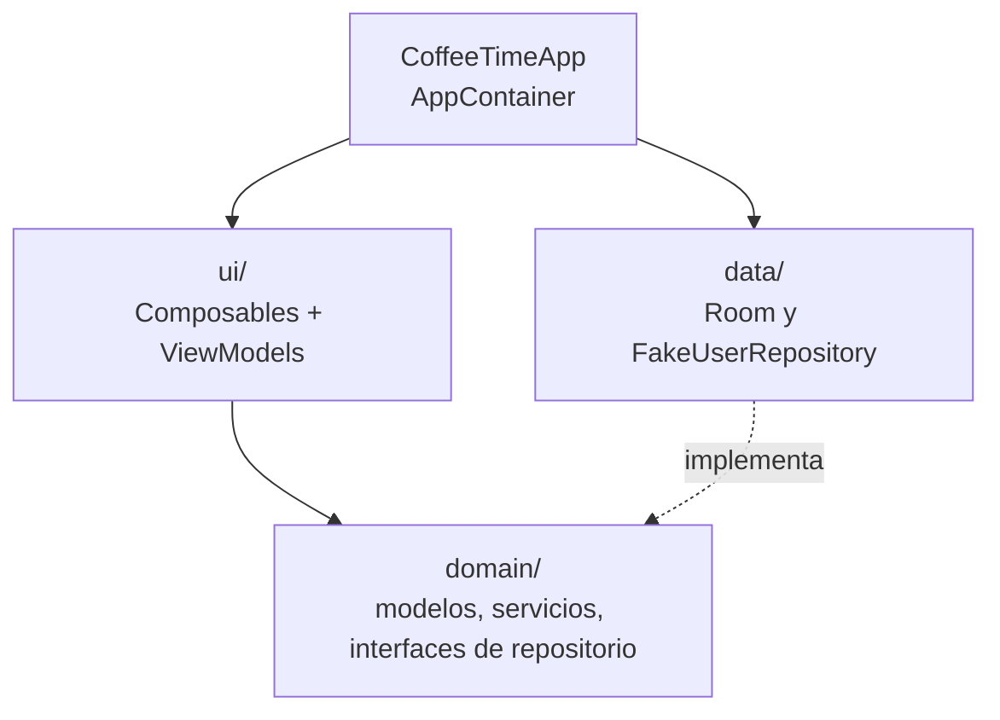
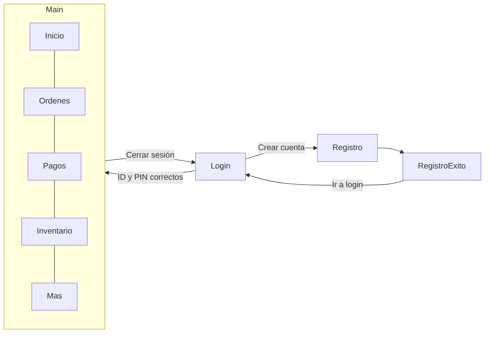

# Coffee Time

App Android de caja para una cafetería (proyecto universitario). La usan el **cajero** (tomar órdenes y cobrar) y el **administrador** (inventario, reportes y cierre de caja). Hecha con Kotlin, Jetpack Compose y Material 3.

> La versión de consola (Etapa 2: Kotlin/JVM + SQLite JDBC) quedó guardada en el tag [`etapa-2`](https://github.com/CesarGonzalez2601/coffee-time/tree/etapa-2). Desde la Etapa 3 el repo es un proyecto de Android Studio.

## Estado: Etapa 3 · Avance 1

Entrega: 18/10/2026. Seguimiento en la [milestone](https://github.com/CesarGonzalez2601/coffee-time/milestone/1).

| Issue | Qué | Estado |
| --- | --- | --- |
| #7 | Base del proyecto Android (este esqueleto) | listo |
| #8 | Usuarios en Room + login real | listo |
| #9 | Login con PinPad | pendiente |
| #10 | Registro con validaciones | pendiente |
| #11 | Navegación por rol + Inicio | pendiente |
| #12 | PDF APA 7 | pendiente |
| #13 | Integración y video | pendiente |

Hoy las pantallas son placeholders conectados por la navegación. Los usuarios ya se guardan en Room; las pantallas de login y registro (#9, #10) son las que los usan.

## Tech stack

Todas las versiones están fijas en [`gradle/libs.versions.toml`](gradle/libs.versions.toml). No las cambies en tu rama.

| Pieza | Qué usamos |
| --- | --- |
| Lenguaje | Kotlin (JDK 17 para compilar) |
| UI | Jetpack Compose + Material 3 |
| Navegación | Navigation Compose type-safe (`@Serializable`) |
| Estado | ViewModel (MVVM) |
| Base de datos | Room (SQLite local, un solo dispositivo) |
| DI | Manual, en `AppContainer` |
| Logs | `android.util.Log` (Logcat) |
| Android | minSdk 26 (Android 8.0), compile/targetSdk 37 |

## Correr el proyecto

### Requisitos

- [Android Studio](https://developer.android.com/studio) (trae el SDK, el emulador y un JDK).
- Nada más: el repo incluye el Gradle wrapper.

### Desde Android Studio

1. `File → Open` y elige la carpeta del repo.
2. Espera el *Gradle sync*.
3. Elige un emulador o teléfono y dale *Run ▶*.

### Desde la terminal

Android Studio crea `local.properties` con la ruta del SDK. Si usas solo la terminal, créalo tú:

```properties
sdk.dir=C\:\\Users\\<tu-usuario>\\AppData\\Local\\Android\\Sdk
```

```bash
./gradlew assembleDebug   # genera el APK de debug
./gradlew installDebug    # lo instala en el emulador/teléfono conectado
./gradlew test            # tests JVM (sin emulador)
./gradlew connectedDebugAndroidTest  # tests de Room en el emulador/teléfono
./gradlew lint
```

Si `java` no está en el `PATH`, apunta `JAVA_HOME` al JDK de Android Studio (`<Android Studio>/jbr`).

### Usuarios de prueba

| ID | PIN | Rol |
| --- | --- | --- |
| 1 | `2580` | Administrador |
| 2 | `1397` | Cajero |

`1234` ya no sirve: cuenta como PIN débil.

Se crean la primera vez que la app abre la base (`UserSeedCallback`). Los usuarios que registres se quedan guardados; para volver a solo estos dos, borra los datos de la app (*Ajustes → Apps → Coffee Time → Almacenamiento → Borrar datos*) o desinstálala.

## Arquitectura

Tres capas. La UI nunca toca la base de datos: siempre le pide al dominio.


```mermaid
flowchart TD
    UI["ui/<br/>Composables + ViewModels"] --> Domain["domain/<br/>modelos, servicios, interfaces de repositorio"]
    Data["data/<br/>Room y FakeUserRepository"] -. implementa .-> Domain
    App["CoffeeTimeApp<br/>AppContainer"] --> UI
    App --> Data
```

```
app/src/main/java/com/coffeetime/
├── CoffeeTimeApp.kt        Application; crea el AppContainer
├── MainActivity.kt         setContent { CoffeeTimeTheme { CoffeeTimeNavHost() } }
├── di/AppContainer.kt      dependencias conectadas a mano
├── domain/
│   ├── model/              User (abstracta), Administrator, Cashier, Role, Permission, Credentials
│   ├── exception/          IncorrectPin, InvalidInput, PermissionDenied, UserNotFound
│   ├── repository/         UserRepository (funciones suspend)
│   ├── security/           PinSecurity (PBKDF2WithHmacSHA256, 120k iteraciones)
│   └── service/            AuthenticationService, Session
├── data/
│   ├── local/              Room: UserEntity, UserDao, AppDatabase, seed, UserRepositoryRoom
│   └── fake/               FakeUserRepository (en memoria, para tests JVM)
└── ui/
    ├── theme/              Color, Theme, Type, Shape, Dimens (design system)
    ├── navigation/         Routes.kt + CoffeeTimeNavHost.kt
    ├── common/             PlaceholderScreen
    ├── login/  registro/  main/
```

### Navegación


```mermaid
flowchart LR
    Login -->|Crear cuenta| Registro --> RegistroExito -->|Ir a login| Login
    Login -->|ID y PIN correctos| Main
    Main -->|Cerrar sesión| Login
    subgraph Main
        Inicio --- Ordenes --- Pagos --- Inventario --- Mas
    end
```

Al entrar a `Main` se borra el historial (`popUpTo(Login) { inclusive = true }`), así el botón atrás no vuelve al login.

### Roles y permisos

`User.hasPermission(Permission)` decide todo. `Administrator` tiene todos los permisos; `Cashier` solo `CREATE_ORDER` y `PROCESS_PAYMENT`. `Session.validatePermission` lanza `PermissionDeniedException`.

### Login y registro

`AuthenticationService` es la única entrada:

- `login(userId, pin)` valida y, si es correcto, inicia la `Session`.
- `register(name, pin)` crea siempre un **cajero** y devuelve el `User` con su ID nuevo. Las validaciones de la pantalla (nombre, PIN débil, confirmación) van antes, en el ViewModel de Registro.
- `logout()` limpia la sesión.

La base no tiene migraciones: si cambia el esquema, se borra y se vuelve a crear con los usuarios de prueba.

## Diseño

La UI sigue el [design system de Coffee Time](https://claude.ai/artifact/Mccf9QuFCj8k9TAcb1EnpY): tonos de café, Fraunces para títulos, Figtree para el resto, botones en píldora. Fuentes bajo SIL OFL 1.1 (ver [`licenses/`](licenses/)).

## Reglas del equipo

- Cada quien trabaja en `feature/<tema>` y abre PR hacia `dev`. `dev` pasa a `main` cuando todo está probado.
- Textos en `res/values/strings.xml`, en español con **tuteo** ("Ingresa tu PIN"). Nunca escritos directo en un Composable.
- Colores, fuentes y tamaños salen de `MaterialTheme` y de `Space` / `Size`. Nada de colores a mano.
- Versiones de librerías solo en `libs.versions.toml`.
